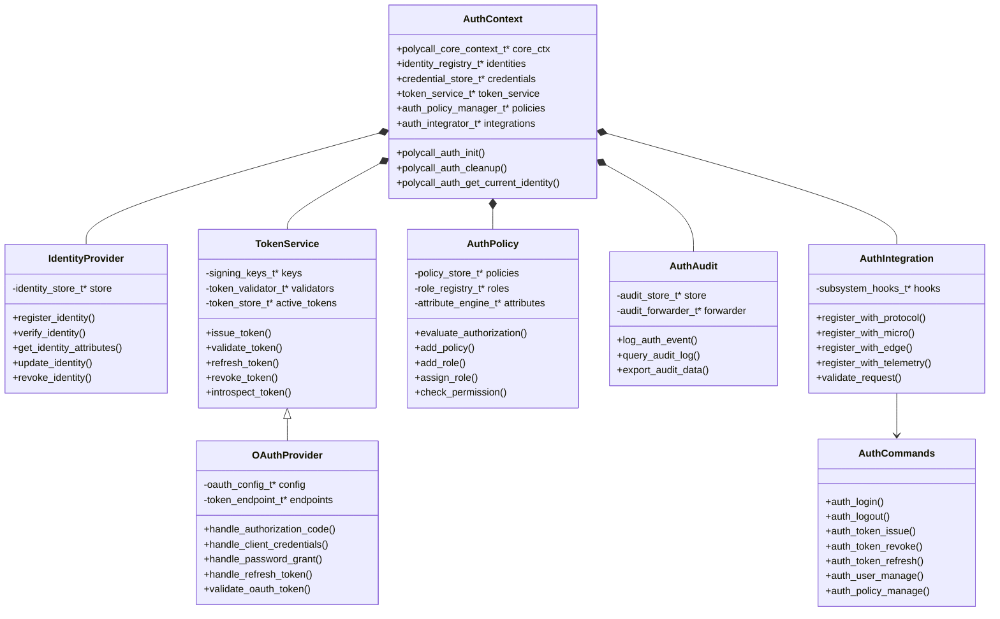
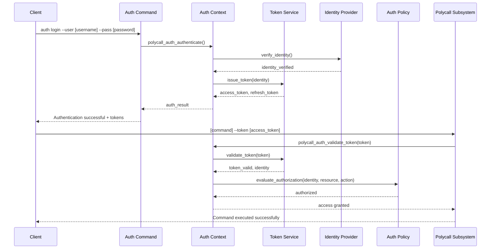

# Authentication & Authorization Module Design for LibPolyCall


## Proposed Auth Module Architecture

Based on your article on API security and examining the needs of LibPolyCall's interface-as-program model, I recommend implementing a comprehensive auth module following the Zero Trust architecture principles.

### UML Component Diagram



### Auth Flow Sequence Diagram



## Implementation Strategy

### 1. Core Auth Module Components

The auth module should consist of these key files:

```
src/core/auth/
├── CMakeLists.txt
├── polycall_auth_context.c
├── identity_provider.c
├── token_service.c
├── auth_policy.c
├── auth_audit.c
├── auth_integration.c
├── oauth_provider.c
└── credential_manager.c

include/polycall/core/auth/
├── polycall_auth_context.h
├── polycall_auth_identity.h
├── polycall_auth_token.h
├── polycall_auth_policy.h
├── polycall_auth_audit.h
├── polycall_auth_integration.h
└── polycall_auth_oauth.h
```

### 2. Token Implementation

Based on your API security article, I recommend implementing a hybrid token approach:

1. **Access Tokens**: Short-lived JWTs containing identity claims, permissions, and signature validation
2. **Refresh Tokens**: Longer-lived opaque tokens stored securely for obtaining new access tokens
3. **API Keys**: For service-to-service authentication with proper scope limitations

The token service should support:
- JWT signing and validation with rotation-capable keys
- Symmetric and asymmetric cryptography options
- Claims-based verification with time validation
- Token revocation through blacklisting/centralized validation

### 3. Zero Trust Implementation

Following Zero Trust principles:

1. **Verify explicitly**: 
   - Every request to any LibPolyCall subsystem must be authenticated
   - No implicit trust based on network location or source
   - Continuous validation throughout request lifecycle

2. **Least privilege access**:
   - Fine-grained permission model tied to specific operations
   - Default-deny policy with explicit grants
   - Time-bounded access rights

3. **Assume breach**:
   - All tokens include device/context information
   - Anomaly detection for unusual patterns
   - Immutable audit logging of all auth events

### 4. OAuth 2.0 Integration

I recommend implementing OAuth 2.0 support with these flows:

1. **Client Credentials**: For service-to-service authentication
2. **Authorization Code**: For user-facing applications
3. **Password Grant**: For trusted first-party clients
4. **Refresh Token**: For maintaining sessions without re-authentication

### 5. Integration Points

The auth module should integrate with:

1. **Protocol Module**: Add auth-specific message types and handlers
2. **Micro Command**: Add authorization checks to command execution
3. **Edge Computing**: Distribute auth tokens securely across edge nodes
4. **Telemetry**: Add auth events to telemetry for security monitoring
5. **Config**: Store auth configuration securely

## Security Considerations

1. **Credential Storage**: 
   - Use secure hashing (Argon2id) for passwords
   - Never log or expose credentials in plaintext
   - Consider hardware security module integration for production

2. **Token Security**:
   - Implement proper token expiration with short timeframes
   - Include audience and issuer validation
   - Use cryptographically secure random generation for tokens
   - Implement token binding to prevent token theft attacks

3. **Attack Mitigation**:
   - Rate limiting on authentication endpoints
   - Delay responses on failed attempts
   - Account lockout policies with secure recovery
   - Protection against token substitution attacks

## Example Auth Command Interface

```
polycall auth login --username [username] --password [password]
polycall auth token refresh --refresh-token [token]
polycall auth token revoke --token [token]
polycall auth user create --username [username] --role [role]
polycall auth policy add --resource [resource] --action [action] --role [role]
```
