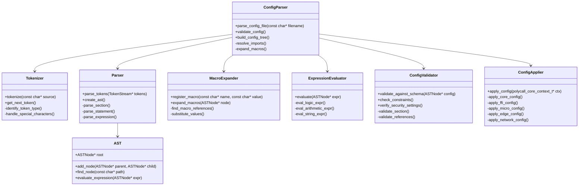
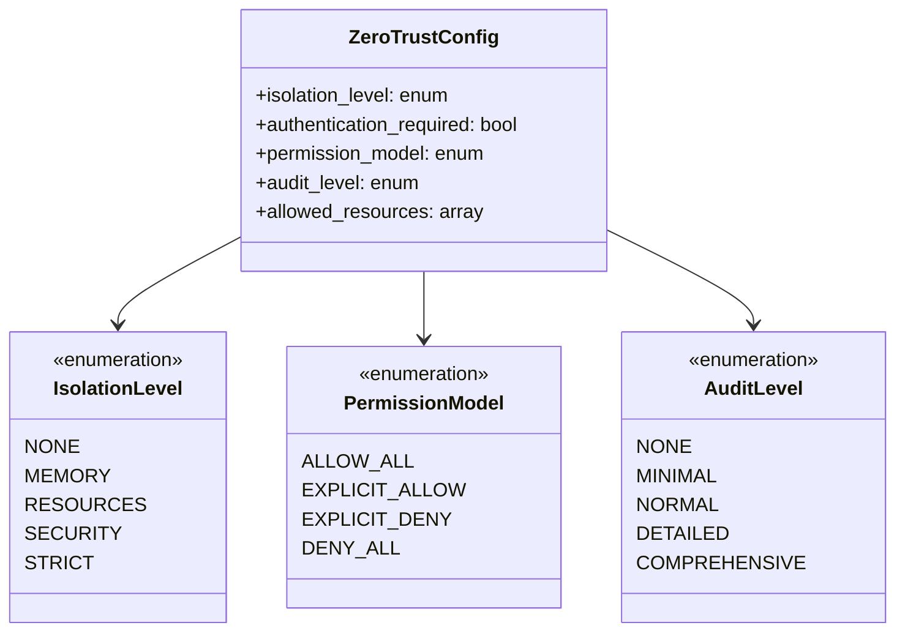

# LibPolyCall Configuration Parser System Architecture

## Overview of Parser Requirements

After analyzing the current LibPolyCall codebase structure and configuration needs, I've identified several critical requirements for the configuration parser system that will support both `config.Polycallfile` and `.polycallrc` files.

The parser must support:
1. A hierarchical configuration model with clear inheritance patterns
2. Macro definition and expansion capabilities
3. Expression evaluation for conditional configurations
4. Specialized configuration sections for security, networking, and module-specific settings
5. Cross-file references and imports

## Parser Component Architecture



## Configuration Structure Design

The configuration structure will support a hierarchical model with inheritance:

```mermaid
classDiagram
    class ConfigNode {
        +string name
        +ConfigNodeType type
        +map~string, ConfigValue~ properties
        +vector~ConfigNode*~ children
        +ConfigNode* parent
    }

    class ConfigValue {
        +ConfigValueType type
        +union value {
            int64_t integer_value
            double float_value
            string string_value
            bool boolean_value
            vector~ConfigValue~ array_value
            ConfigNode* reference
        }
        +evaluate()
        +toString()
    }

    class MacroDefinition {
        +string name
        +string pattern
        +vector~string~ parameters
        +ConfigValue expansion
        +evaluate(vector~ConfigValue~ args)
    }

    class ConfigSchema {
        +map~string, SchemaRule~ rules
        +validate(ConfigNode* config)
        +generate_default_config()
    }

    class SchemaRule {
        +string path
        +ConfigValueType type
        +bool required
        +ConfigValue default_value
        +vector~Constraint~ constraints
        +validate(ConfigValue value)
    }

    ConfigNode --> ConfigValue
    ConfigValue --> ConfigNode
    ConfigSchema --> SchemaRule
    MacroDefinition --> ConfigValue
```

## File Format Specifications

### config.Polycallfile (Global Configuration)

The global configuration file follows this structure:

```
# Global Configuration

@define PORT_RANGE 8080:8084  # Global macro definition

# Core configuration
core {
    log_level = "info"
    max_memory = 1024MB
    workspace = "/opt/polycall"
}

# Network configuration
network {
    use PORT_RANGE  # Macro expansion
    max_connections = 1000
    timeout = 5000ms
    
    # TLS configuration
    tls {
        enabled = true
        cert_file = "/etc/polycall/cert.pem"
        key_file = "/etc/polycall/key.pem"
    }
}

# FFI configuration
ffi {
    languages = ["c", "node", "python", "java"]
    
    # Zero-trust settings
    security {
        isolation_level = "strict"
        require_authentication = true
        audit_level = "detailed"
    }
}

# Micro command configuration
micro {
    @define SECURE_COMPONENT isolation_level="strict" require_auth=true
    
    # Define a secure component
    component bankcard {
        use SECURE_COMPONENT  # Apply the macro
        data_scope = "isolated"
        allowed_connections = ["payment_gateway", "user_db"]
        max_memory = 512MB
    }

    # Define a less-secure component
    component ads_service {
        isolation_level = "standard"
        data_scope = "restricted"
        allowed_connections = ["ad_server"]
        max_memory = 256MB
    }
}

# Edge configuration
edge {
    selection_strategy = "proximity"
    fallback_enabled = true
    timeout = 3000ms
    require_secure = true
}
```

### .polycallrc (Binding-Specific Configuration)

The binding-specific configuration follows this structure:

```
# Node.js Language Binding Configuration

# Port mapping for host:container
port = @PORT_RANGE  # Reference global macro

# Server type specification
server_type = "node"

# Security configuration
security {
    isolation_level = "strict"  # Zero-trust setting
    permissions = ["file_read", "net_connect"]
    require_auth = true
}

# Performance settings
performance {
    max_memory = 512MB
    timeout = 30s
    pool_size = 100MB
}

# Conditionally apply settings
@if (server_type == "node" && performance.max_memory > 256MB) {
    # Node-specific optimizations for larger memory
    v8_options = "--max-old-space-size=512"
    gc_interval = 60s
}

# Import shared security configuration
@import "common_security.polycallrc"
```

## Implementation Plan

I'll outline a phased implementation plan:

### Phase 1: Core Parser Infrastructure

1. Implement the Tokenizer class with support for:
   - Identifier recognition
   - Numeric literals (with unit suffixes)
   - String literals
   - Special symbols ({}, [], =, etc.)
   - Comments (both line and block)

2. Implement the Parser class with support for:
   - Section parsing
   - Assignment statements
   - Nested sections
   - Array values
   - Basic directives (@define, @import)

3. Implement the AST (Abstract Syntax Tree) class:
   - Node hierarchy
   - Property storage
   - Basic traversal methods

### Phase 2: Macro and Expression Support

1. Implement the MacroExpander class:
   - Macro registration
   - Simple value substitution
   - Parameterized macros
   - Scope management

2. Implement the ExpressionEvaluator class:
   - Boolean expressions
   - Arithmetic expressions
   - String operations
   - Comparison operations
   - Basic type coercion

3. Implement conditional directives:
   - @if condition { ... }
   - @else { ... }
   - @for loops

### Phase 3: Validation and Application

1. Implement the ConfigValidator class:
   - Schema-based validation
   - Type checking
   - Range constraints
   - Required fields
   - Dependency validation

2. Implement the ConfigApplier class:
   - Configuration application to core context
   - Module-specific configuration application
   - Security policy application
   - Resource limit application

### Phase 4: Integration and Testing

1. Integrate with existing LibPolyCall modules:
   - Core module integration
   - FFI module integration
   - Micro command integration
   - Edge command integration
   - Network module integration

2. Develop comprehensive tests:
   - Parser unit tests
   - Expression evaluation tests
   - Macro expansion tests
   - Configuration validation tests
   - Integration tests with actual modules

## Zero-Trust Binding Configuration Model

For the zero-trust binding requirements, I'll define a specific security configuration model:



This security model will be applied throughout the configuration parser, with specific validation rules to ensure that security configurations meet the requirements for zero-trust operation.

## Next Steps

Based on this system plan, the next immediate steps would be:

1. Finalize the detailed API design for each component
2. Implement the core Tokenizer and Parser classes
3. Develop unit tests for the parser components
4. Integrate with the existing LibPolyCall codebase
5. Begin implementation of the configuration validator

Would you like me to proceed with any specific aspect of this plan in more detail?