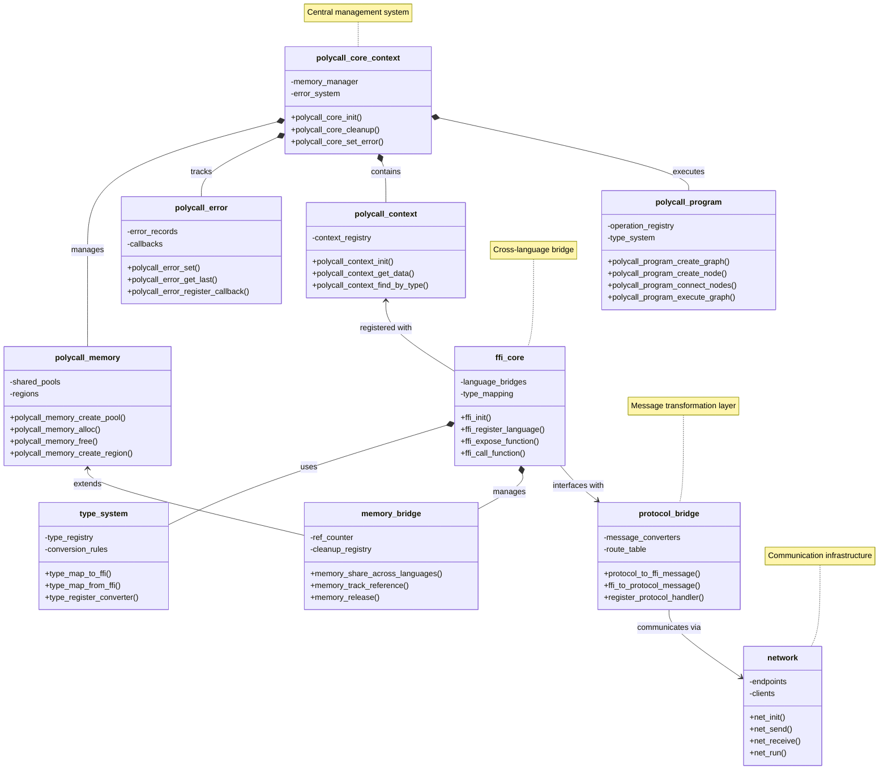

```mermaid
classDiagram
    class polycall_core_context {
        +polycall_core_init()
        +polycall_core_cleanup()
        +polycall_core_set_error()
        -memory_manager
        -error_system
    }
    
    class polycall_memory {
        +polycall_memory_create_pool()
        +polycall_memory_alloc()
        +polycall_memory_free()
        +polycall_memory_create_region()
        -shared_pools
        -regions
    }
    
    class polycall_error {
        +polycall_error_set()
        +polycall_error_get_last()
        +polycall_error_register_callback()
        -error_records
        -callbacks
    }
    
    class polycall_context {
        +polycall_context_init()
        +polycall_context_get_data()
        +polycall_context_find_by_type()
        -context_registry
    }
    
    class polycall_program {
        +polycall_program_create_graph()
        +polycall_program_create_node()
        +polycall_program_connect_nodes()
        +polycall_program_execute_graph()
        -operation_registry
        -type_system
    }

    class ffi_core {
        +ffi_init()
        +ffi_register_language()
        +ffi_expose_function()
        +ffi_call_function()
        -language_bridges
        -type_mapping
    }
    
    class type_system {
        +type_map_to_ffi()
        +type_map_from_ffi()
        +type_register_converter()
        -type_registry
        -conversion_rules
    }
    
    class memory_bridge {
        +memory_share_across_languages()
        +memory_track_reference()
        +memory_release()
        -ref_counter
        -cleanup_registry
    }

    class network {
        +net_init()
        +net_send()
        +net_receive()
        +net_run()
        -endpoints
        -clients
    }
    
    class protocol_bridge {
        +protocol_to_ffi_message()
        +ffi_to_protocol_message()
        +register_protocol_handler()
        -message_converters
        -route_table
    }

    polycall_core_context *-- polycall_memory : manages
    polycall_core_context *-- polycall_error : tracks
    polycall_core_context *-- polycall_context : contains
    polycall_core_context *-- polycall_program : executes
    
    polycall_context <-- ffi_core : registered with
    ffi_core *-- type_system : uses
    ffi_core *-- memory_bridge : manages
    ffi_core --> protocol_bridge : interfaces with
    
    protocol_bridge --> network : communicates via
    
    polycall_memory <-- memory_bridge : extends
    
    note for polycall_core_context "Central management system"
    note for ffi_core "Cross-language bridge"
    note for protocol_bridge "Message transformation layer"
    note for network "Communication infrastructure"
```