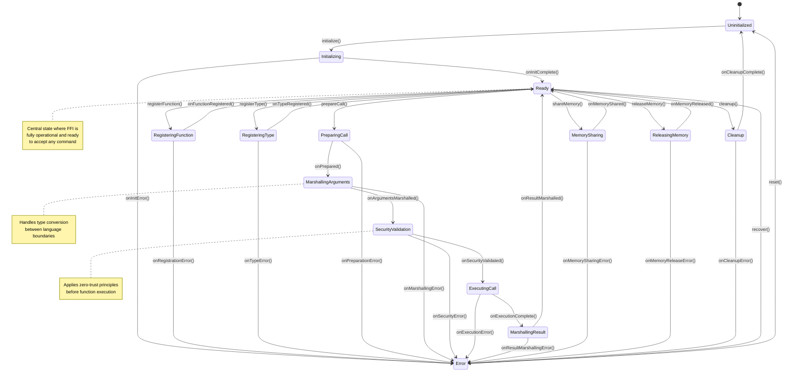

```mermaid
stateDiagram-v2
    [*] --> Uninitialized
    
    Uninitialized --> Initializing: initialize()
    Initializing --> Ready: onInitComplete()
    Initializing --> Error: onInitError()
    
    Ready --> RegisteringFunction: registerFunction()
    RegisteringFunction --> Ready: onFunctionRegistered()
    RegisteringFunction --> Error: onRegistrationError()
    
    Ready --> RegisteringType: registerType()
    RegisteringType --> Ready: onTypeRegistered()
    RegisteringType --> Error: onTypeError()
    
    Ready --> PreparingCall: prepareCall()
    PreparingCall --> MarshallingArguments: onPrepared()
    PreparingCall --> Error: onPreparationError()
    
    MarshallingArguments --> SecurityValidation: onArgumentsMarshalled()
    MarshallingArguments --> Error: onMarshallingError()
    
    SecurityValidation --> ExecutingCall: onSecurityValidated()
    SecurityValidation --> Error: onSecurityError()
    
    ExecutingCall --> MarshallingResult: onExecutionComplete()
    ExecutingCall --> Error: onExecutionError()
    
    MarshallingResult --> Ready: onResultMarshalled()
    MarshallingResult --> Error: onResultMarshallingError()
    
    Ready --> MemorySharing: shareMemory()
    MemorySharing --> Ready: onMemoryShared()
    MemorySharing --> Error: onMemorySharingError()
    
    Ready --> ReleasingMemory: releaseMemory()
    ReleasingMemory --> Ready: onMemoryReleased()
    ReleasingMemory --> Error: onMemoryReleaseError()
    
    Ready --> Cleanup: cleanup()
    Cleanup --> Uninitialized: onCleanupComplete()
    Cleanup --> Error: onCleanupError()
    
    Error --> Ready: recover()
    Error --> Uninitialized: reset()
    
    note right of SecurityValidation
        Applies zero-trust principles
        before function execution
    end note
    
    note right of MarshallingArguments
        Handles type conversion
        between language boundaries
    end note
    
    note right of Ready
        Central state where FFI is
        fully operational and ready
        to accept any command
    end note
```