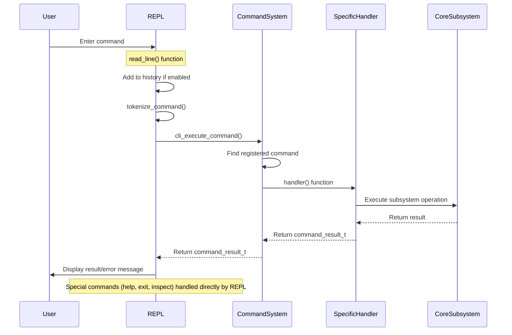

```mermaid
sequenceDiagram
    participant User
    participant REPL
    participant CommandSystem
    participant SpecificHandler
    participant CoreSubsystem
    
    User->>REPL: Enter command
    Note over REPL: read_line() function
    REPL->>REPL: Add to history if enabled
    REPL->>REPL: tokenize_command()
    REPL->>CommandSystem: cli_execute_command()
    CommandSystem->>CommandSystem: Find registered command
    CommandSystem->>SpecificHandler: handler() function
    SpecificHandler->>CoreSubsystem: Execute subsystem operation
    CoreSubsystem-->>SpecificHandler: Return result
    SpecificHandler-->>CommandSystem: Return command_result_t
    CommandSystem-->>REPL: Return command_result_t
    REPL->>User: Display result/error message
    
    Note over REPL: Special commands (help, exit, inspect) handled directly by REPL
```