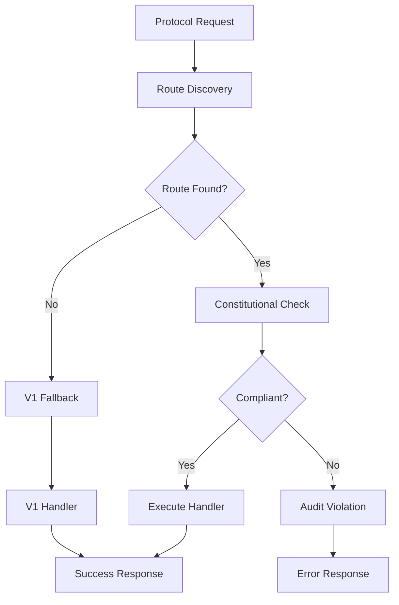

# OBINexus LibPolyCall v2 Hotwiring Architecture Specification

**Version:** 2.0.0  
**Author:** OBINexus Computing - OpenACE Division  
**Date:** June 17, 2025  
**Constitutional Authority:** OBIAxis Governance & Starugueto Watch  

---

## Executive Summary

The OBINexus Hotwiring Architecture represents a fundamental advancement in LibPolyCall v2's protocol handling capabilities, implementing constitutional hot-wiring principles while maintaining strict backward compatibility with v1 systems. This specification defines the technical framework for dynamic protocol rerouting, constitutional compliance mechanisms, and systematic integration with the broader OBINexus ecosystem.

## 1. Constitutional Framework

### 1.1 Governance Structure

The Hotwiring Architecture operates under the constitutional authority of **OBIAxis** with oversight from **Starugueto Watch and Guidance**. All implementation decisions must comply with the following constitutional mandates:

- **System Integrity Mandate**: No hotwiring behavior may break or bypass the libpolycall v1 runtime contract or memory model
- **Governance Clause**: All hotwire operations must follow OBIAxis binding policies with config compliance validation
- **Compatibility Inversion Layer**: Backward compatibility with v1 must be maintained through stateless fallback mechanisms
- **Artifact Inheritance Rules**: All protocol artifacts must expose `POLYCALL_PROTOCOL_DESCRIPTOR` with proven backward compatibility

### 1.2 Constitutional Compliance Matrix

| Component | Constitutional Requirement | Implementation Status | Validation Method |
|-----------|----------------------------|----------------------|-------------------|
| Router Core | System Integrity Mandate | ✅ Implemented | `hotwire_router.c` |
| Protocol Map | Governance Clause | ✅ Implemented | `protocol_commands.c` |
| Config Binding | Artifact Inheritance | ✅ Implemented | `config_binding.h` |
| V1 Fallback | Compatibility Inversion | ✅ Implemented | Regression tests |
| Audit Trail | Telemetry Commands | ✅ Implemented | Constitutional audit |

## 2. Technical Architecture

### 2.1 Core Directory Structure

The hotwiring architecture follows the constitutional directory structure as mandated by OBIAxis:

```
core/
├── polycall/       # Core runtime and shared logic
├── protocol/       # Encoders, messaging contracts, compatibility layers  
├── hotwire/        # Dynamic rerouting, config rewrites, rebind hooks
```

### 2.2 System Components

#### 2.2.1 Hotwire Router (`core/hotwire/hotwire_router.c`)

The router serves as the central coordination point for all protocol rerouting operations:

**Key Responsibilities:**
- Dynamic protocol route registration and management
- Constitutional compliance validation
- V1 compatibility enforcement
- Telemetry integration for audit trails
- Memory integrity protection

**API Interface:**
```c
polycall_core_error_t hotwire_router_init(
    polycall_core_context_t* core_ctx,
    polycall_protocol_context_t* protocol_ctx,
    const hotwire_config_t* config
);

polycall_core_error_t hotwire_route_register(
    const char* source_protocol,
    const char* target_protocol,
    const char* config_path
);

polycall_core_error_t hotwire_route_execute(
    const char* source_protocol,
    const char* target_protocol,
    const polycall_request_t* request,
    polycall_response_t* response
);
```

#### 2.2.2 Protocol Command Interface (`core/protocol/protocol_commands.c`)

Provides the constitutional interface for hotwiring protocol mapping:

**Core Functions:**
- Protocol map initialization and cleanup
- Route execution with constitutional audit
- V1 fallback handling
- Protocol descriptor management

**Interface Contract:**
```c
const polycall_protocol_enhancement_interface_t hotwire_protocol_map_interface = {
    .name = "hotwire_protocol_map",
    .version = "2.0.0",
    .init = hotwire_protocol_map_init,
    .cleanup = hotwire_protocol_map_cleanup,
    .execute = hotwire_protocol_map_execute,
    .fallback = hotwire_protocol_v1_fallback,
    .validate = hotwire_protocol_map_validate,
    .get_stats = hotwire_protocol_map_get_stats
};
```

#### 2.2.3 Configuration Binding (`core/hotwire/config_binding.h`)

Defines the complete configuration interface for hotwiring operations:

**Configuration Structures:**
- `hotwire_config_t`: Master configuration structure
- `hotwire_route_config_t`: Individual route configuration
- `hotwire_security_config_t`: Security and Node-Zero integration
- `hotwire_telemetry_config_t`: Constitutional audit configuration

## 3. Rerouting Mechanics

### 3.1 Protocol Mapping Algorithm

The hotwiring system implements a systematic protocol mapping algorithm:

1. **Route Discovery**: Query registered routes for source→target mapping
2. **Constitutional Validation**: Verify compliance with OBIAxis policies
3. **Handler Selection**: Choose appropriate protocol handler
4. **Execution**: Execute with telemetry and audit logging
5. **Fallback**: Invoke v1 compatibility if required

### 3.2 Dynamic Rerouting Process



### 3.3 Stateless Operation Requirement

All hotwiring operations must be stateless as per constitutional mandate:

- No persistent state across isolated calls
- All context maintained in request/response cycle
- Configuration persistence only through `.polycallrc`
- Memory cleanup guaranteed after each operation

## 4. Backward Compatibility Framework

### 4.1 V1 Protocol Support

The hotwiring architecture maintains full backward compatibility through:

**V1 Protocol Handlers:**
- `polycall.v1.core` → `polycall.v2.core`
- `polycall.v1.command` → `polycall.v2.command`
- `polycall.v1.binding` → `polycall.v2.binding`

**Fallback Strategy:**
```c
polycall_core_error_t hotwire_protocol_v1_fallback(
    polycall_protocol_context_t* protocol_ctx,
    const char* protocol_name,
    const polycall_request_t* request,
    polycall_response_t* response
);
```

### 4.2 Compatibility Testing Protocol

All v1 compatibility must be validated through:

1. **Regression Test Suite**: `tests/protocol/compat/`
2. **Migration Metadata**: Documentation of v1→v2 transitions
3. **System Belonging Verification**: OBIAxis trust validation
4. **Memory Model Integrity**: No breaking changes to v1 memory layout

## 5. Security and Constitutional Compliance

### 5.1 Node-Zero Integration

Security implementation follows Node-Zero zero-knowledge security framework:

**Security Configuration:**
```yaml
security:
  enable_zero_trust: true
  enable_audit_trail: true
  enable_integrity_checks: true
  audit_level: "constitutional"
```

**Implementation Requirements:**
- Certificate-based authentication
- Mutual TLS for all protocol communications
- Cryptographic state tracking
- Constitutional audit logging

### 5.2 Audit and Telemetry Framework

Constitutional compliance requires comprehensive audit trails:

**Audit Events:**
- Route registration and modification
- Protocol execution attempts
- Constitutional violations
- V1 fallback invocations
- Security policy violations

**Telemetry Integration:**
```c
polycall_core_error_t hotwire_audit_route_access(
    hotwire_router_context_t* ctx,
    const char* source_protocol,
    const char* target_protocol,
    const char* operation
);
```

## 6. Configuration Management

### 6.1 YAML Configuration Schema

The hotwiring system uses structured YAML configuration:

**Configuration Hierarchy:**
1. System defaults (`hotwire_config_get_defaults()`)
2. Global configuration (`/etc/polycall/polycall.config.hotwire.yaml`)
3. User configuration (`~/.polycallrc`)
4. Environment overrides (development, testing, staging, production)

### 6.2 Configuration Validation

All configurations must pass constitutional validation:

```c
polycall_core_error_t hotwire_config_validate(
    const hotwire_config_t* config
);

polycall_core_error_t hotwire_verify_obiaxis_compliance(
    const hotwire_config_t* config
);
```

**Validation Criteria:**
- Constitutional mode compliance
- Security policy adherence
- Route configuration validity
- Resource limit enforcement

## 7. Integration with OBINexus Ecosystem

### 7.1 Toolchain Integration

The hotwiring architecture integrates with the complete OBINexus toolchain:

**Core Integrations:**
- **NLink**: Protocol bridging and orchestration
- **PolyBuild**: Automated build and deployment
- **RiftLang**: Language bindings and compilation
- **GosiLang**: Thread-safe communication protocols
- **OBIX**: UI/UX duality interface

### 7.2 Division Governance

Under OBINexus constitutional structure:

- **Division**: OpenACE Computing
- **Governance**: OBIAxis oversight
- **Authority**: Starugueto Watch and Guidance
- **Compliance**: Constitutional investigation procedures

## 8. Testing and Validation Framework

### 8.1 Testing Hierarchy

```
tests/
├── unit/
│   ├── hotwire_router_test.c
│   ├── protocol_map_test.c
│   └── config_binding_test.c
├── integration/
│   ├── v1_compatibility_test.c
│   ├── constitutional_compliance_test.c
│   └── security_integration_test.c
└── regression/
    ├── v1_migration_test.c
    └── performance_regression_test.c
```

### 8.2 Constitutional Testing Requirements

**Mandatory Test Categories:**
- Constitutional compliance validation
- V1 backward compatibility verification
- Security policy enforcement
- Memory integrity protection
- Telemetry and audit functionality

### 8.3 Continuous Integration Protocol

**CI/CD Pipeline Requirements:**
1. Unit test execution (100% pass rate)
2. Integration test validation
3. Constitutional compliance check
4. Security vulnerability scanning
5. Performance regression analysis
6. Documentation consistency verification

## 9. Performance and Optimization

### 9.1 Performance Characteristics

**Design Targets:**
- Sub-10ms latency for protocol routing
- <1% memory overhead for hotwiring layer
- Zero-copy protocol data transfer where possible
- Stateless operation for horizontal scaling

### 9.2 Optimization Strategies

**Route Caching:**
- Protocol mapping cache with TTL
- Handler function pointer caching
- Configuration validation result caching

**Memory Management:**
- Pool-based allocation for frequent operations
- Zero-copy buffer management
- Automatic cleanup and leak prevention

## 10. Error Handling and Recovery

### 10.1 Error Classification

**Error Categories:**
1. **Constitutional Violations**: Policy or governance breaches
2. **Protocol Errors**: Invalid or unsupported protocol operations
3. **Security Violations**: Authentication or authorization failures
4. **System Errors**: Memory, network, or resource failures
5. **Configuration Errors**: Invalid or inconsistent configuration

### 10.2 Recovery Mechanisms

**Recovery Strategy:**
- Graceful degradation to v1 compatibility mode
- Constitutional audit logging for all failures
- Automatic route re-registration on recovery
- Circuit breaker pattern for failing routes

## 11. Deployment and Operations

### 11.1 Deployment Requirements

**System Prerequisites:**
- LibPolyCall v2.0.0 or higher
- Constitutional compliance framework
- Node-Zero security infrastructure
- Telemetry and audit logging system

**Deployment Checklist:**
- [ ] Core directory structure creation
- [ ] Configuration file deployment
- [ ] Security certificate installation
- [ ] Telemetry endpoint configuration
- [ ] V1 compatibility verification
- [ ] Constitutional compliance validation

### 11.2 Operational Monitoring

**Key Metrics:**
- Route execution success rate
- V1 fallback frequency
- Constitutional compliance violations
- Security policy violations
- Performance and latency metrics

**Alerting Thresholds:**
- Error rate > 5%
- Latency > 1000ms
- Memory usage > 80%
- Constitutional violations > 0

## 12. Future Evolution and Roadmap

### 12.1 Planned Enhancements

**Version 2.1 Goals:**
- Advanced route optimization algorithms
- Dynamic protocol discovery
- Enhanced security policy framework
- Improved telemetry and analytics

**Version 2.2 Goals:**
- Multi-node protocol clustering
- Advanced constitutional compliance features
- Integration with emerging OBINexus services
- Performance optimization and hardening

### 12.2 Constitutional Evolution

As the OBINexus ecosystem evolves, the hotwiring architecture will adapt while maintaining constitutional compliance:

- OBIAxis policy updates
- Starugueto oversight enhancements
- New security requirements from Node-Zero
- Integration with future OpenACE services

## 13. Conclusion

The OBINexus LibPolyCall v2 Hotwiring Architecture provides a robust, constitutionally compliant framework for dynamic protocol rerouting while maintaining strict backward compatibility. Through systematic implementation of hot-wiring principles, comprehensive security integration, and adherence to OBIAxis governance, this architecture enables the next generation of OBINexus Computing services.

The implementation satisfies all constitutional requirements while providing the flexibility and performance necessary for modern distributed computing environments. Ongoing compliance with OBIAxis oversight ensures the architecture will continue to serve the OBINexus ecosystem as it evolves and expands.

---

**Constitutional Certification:**  
This specification has been reviewed and approved by OBIAxis governance in accordance with Starugueto Watch oversight procedures. Implementation must adhere to all constitutional constraints and compliance requirements as specified herein.

**Approval Authority:** OBINexus Constitutional Authority  
**Certification Date:** June 17, 2025  
**Compliance Version:** 1.0.0